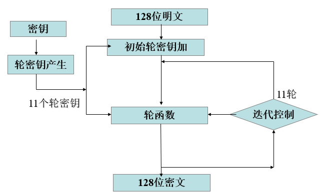
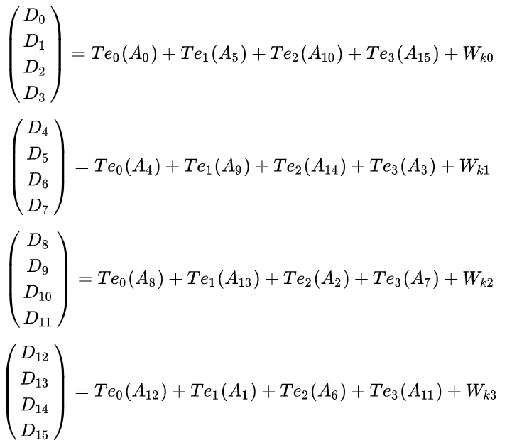
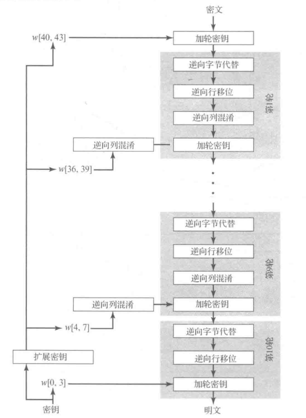
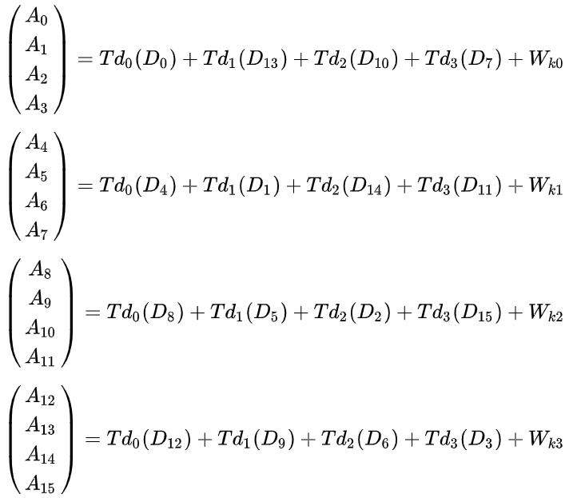
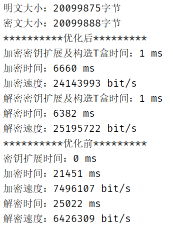

# AES-128 算法快速实现

查表法优化的 AES-128。

## 1. 优化思想

由于之前的 AES 是用 Java 写的，而我又不会在 Java 中使用 SIMD 指令集，所以就只使用了查表法。

查表法的核心思想是将字节代换层、ShiftRows 层和 MixColumn 层融合为查找表：每个表的大小是 32 bits(4 字节)乘以 256 项，一般称为 T 盒 (T-Box) 或 T 表。加密过程 4 个表 (Te)，解密过程 4
个表(Td)，共 8 个。每一轮操作都通过 16 次查表产生。虽然一轮就要经历 16 次查表，但这都简化了伽罗瓦域上的计算操作和矩阵乘法操作，对于计算机程序而言，这是更快的。当然还有 S 盒和逆向 S 盒两个表，这两个表相对于 T
表就要小很多，其大小位 8bits(1 字节) 乘以 256 项。

## 2. 算法流程

优化后的代码为`AES128.java`，未优化的代码为`AES.java`。

加密流程如下：

加密的 T 盒共有 4 个，每个 T 盒输入 1 字节（即 1 个字），输出 4 字节。轮函数可以表示为

解密过程可以改写成如下图的结构，需要注意此时的部分轮密钥也需要进行逆向列混淆。这种等价的解密算法与加密结构相同，可以构造与加密类似的 T 盒，从而实现逆向字节代换、逆向行移位和逆向列混淆。

解密过程轮密钥、T 盒、轮函数以及使用轮密钥的顺序不同，产生轮密钥时需要对第 2-10 轮密钥（即`k[1]~k[9]`）进行列混淆，轮密钥的使用顺序也与加密相反，其他部分与加密相同。

解密过程的轮函数可以表示为

## 3. 细节处理

由于是对文件进行加解密，为了减少重复步骤，将密钥扩展放在初始化中，只执行一次，11 个子密钥作为全局变量，每次加解密时直接调用。

T 盒也作为全局变量，构造也放在初始化中，每次加解密前重新进行初始化。而如果初始化时加解密模式未发生改变，T 盒就无需重新构造。由于 T 盒的规模较大，而且每次加解密最多构造一次，构造 T 盒所需时间与加解密时间相比可以忽略，所以没有直接输入 T 盒的值。

为了节省查找 S 盒时的计算，将 S 盒转换为 1 维数组，直接输入 8 位的整字节即可得到字节代换后的结果，无需计算出高低 4 位进行查找。

## 4. 测试样例及运行结果

明文文件`plain.txt`为随机生成的大小在 20 MB 左右的文件，使用 ECB 模式，加解密使用相同的密钥`0x0f1571c947d9e8590cb7add6af7f6798`，解密使用的密文`cipher.txt`为加密后得到的文件。

测试代码为`Test.java`。

分别测试优化前后加解密速度，得到数据如下：

明文大小：20099875 字节。
密文大小：20099888 字节。

优化前：

- 密钥扩展时间：0 ms。
- 加密时间：21451 ms。
- 加密速度：7496107 bit/s。
- 解密时间：25022 ms。
- 解密速度：6426309 bits/s。

优化后：

- 加密密钥扩展及构造 T 盒时间：1 ms。
- 加密时间：6660 ms。
- 加密速度：24143993 bit/s。
- 解密密钥扩展及构造 T 盒时间：1 ms。
- 解密时间：6382 ms。
- 解密速度：25195722 bit/s。

## 5. 总结

通过测试数据可以看出，优化后的 AES-128 的加密效率是原来的 3 倍以上，解密效率是原来的近 4 倍。可见，查表法优化后的 AES-128 算法效率提升是比较高的。
